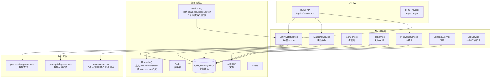
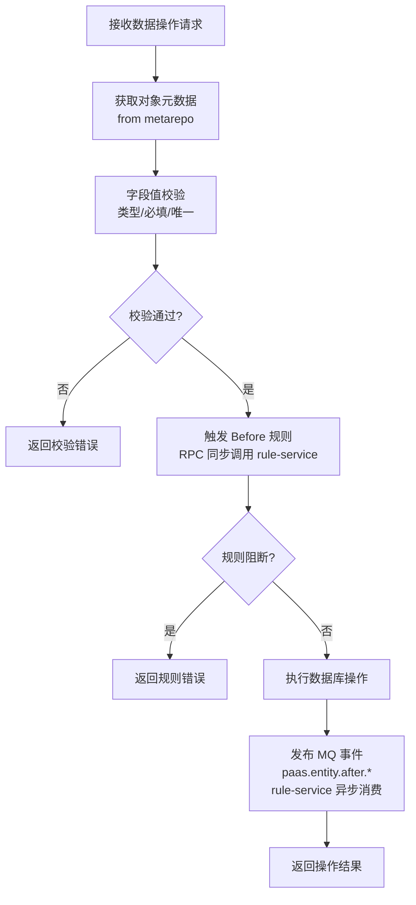
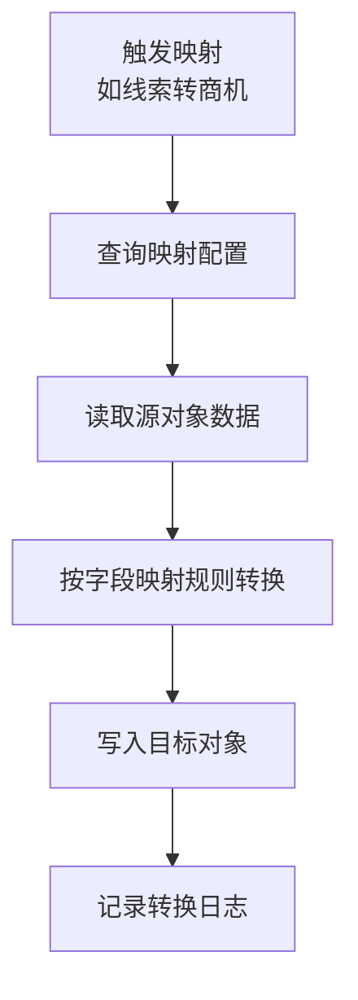
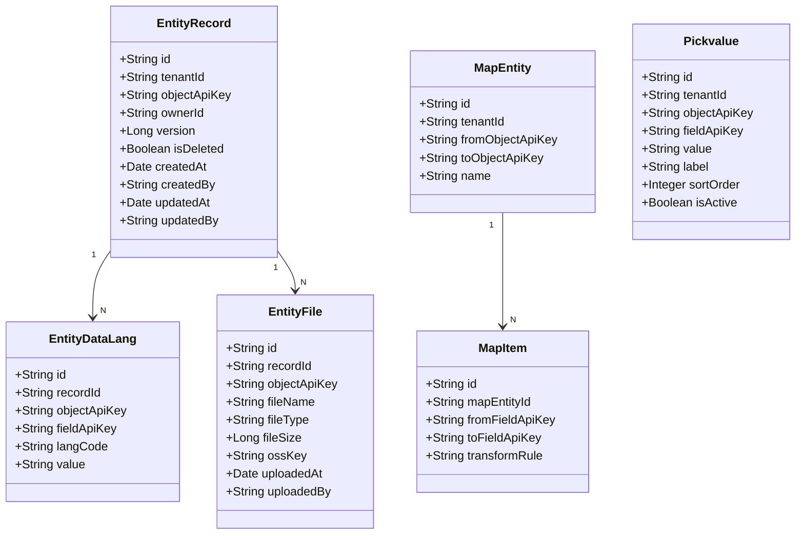
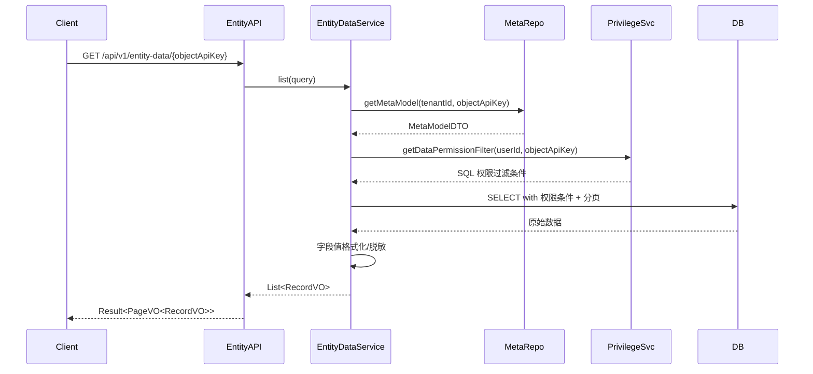
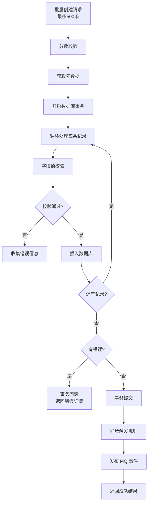

# paas-entity-service 技术设计方案

## 1. 服务概述

实体数据服务，是 aPaaS 平台数据 CRUD 的核心服务。负责自定义对象的数据增删改查、字段映射、多语言、文件存储、选项值管理等。所有业务数据的读写均经过本服务，并在执行前后触发规则引擎和权限过滤。

---

## 2. 系统架构



---

## 3. 模块职责

### 3.1 EntityDataService（数据 CRUD）

平台最核心的服务，处理所有自定义对象的数据操作。

**操作类型：**

| 操作 | 说明 |
|---|---|
| `create` | 创建记录，触发 before/after 规则 |
| `update` | 更新记录，支持部分字段更新 |
| `delete` | 删除记录，支持软删除和硬删除 |
| `query` | 单条查询，带权限过滤 |
| `list` | 分页列表查询，带权限过滤和排序 |
| `batchCreate` | 批量创建，事务保证 |
| `batchUpdate` | 批量更新 |
| `batchDelete` | 批量删除 |

**数据操作流程：**



**关键设计：**
- 动态表结构：自定义对象数据存储在动态生成的表中，表名规则来自 `p_custom_entity.db_table` 字段（由 metarepo 在创建对象时分配）
- 多租户隔离：所有动态表通过 `tenant_id` 列隔离，**不通过表名区分租户**（避免表数量爆炸）
- 字段值序列化：根据字段类型做类型转换和格式化
- 并发控制：更新操作使用乐观锁（version 字段），冲突时返回 409

### 3.2 MappingService（字段映射）

管理对象间的字段映射关系，用于数据转换场景（如线索转商机）。

| 方法 | 说明 |
|---|---|
| `createMapEntity` | 创建对象映射配置 |
| `createMapItem` | 创建字段映射配置 |
| `executeMapping` | 执行映射，将源对象数据转换为目标对象数据 |
| `listMapEntities` | 查询映射配置列表 |

**映射执行流程：**


### 3.3 I18nService（多语言）

管理实体数据的多语言翻译。

- 支持字段值的多语言存储（`entity_data_lang` 表）
- 查询时根据请求语言自动返回对应翻译
- 支持批量导入/导出翻译

### 3.4 FileService（文件存储）

管理实体关联的文件附件。

- 文件上传到 OSS，记录文件元信息到 DB
- 支持文件大小限制、类型白名单校验
- 文件删除时同步清理 OSS 资源
- 统计租户文件存储用量

### 3.5 PickvalueService（选项值）

管理 PICKLIST/MULTIPICKLIST 字段的选项值定义。

- 支持全局选项集和对象级选项集
- 选项值支持多语言标签
- 选项值变更时校验现有数据的合法性

### 3.6 CurrencyService（货币）

管理货币字段的汇率和换算。

- 维护货币汇率表
- CURRENCY 字段存储时同时存原始值和换算后的基准货币值
- 支持按汇率重新计算历史数据

---

## 4. 数据模型



---

## 5. 核心流程

### 5.1 数据查询（带权限过滤）



### 5.2 批量创建（事务保证）



---

## 6. 接口设计

### 6.1 REST 接口

| 方法 | 路径 | 说明 |
|---|---|---|
| POST | `/api/v1/entity-data/{objectApiKey}` | 创建记录 |
| PUT | `/api/v1/entity-data/{objectApiKey}/{id}` | 更新记录 |
| DELETE | `/api/v1/entity-data/{objectApiKey}/{id}` | 删除记录 |
| GET | `/api/v1/entity-data/{objectApiKey}/{id}` | 查询单条 |
| GET | `/api/v1/entity-data/{objectApiKey}` | 分页查询 |
| POST | `/api/v1/entity-data/{objectApiKey}/batch` | 批量创建 |
| PUT | `/api/v1/entity-data/{objectApiKey}/batch` | 批量更新 |
| POST | `/api/v1/mapping/{mapEntityId}/execute` | 执行字段映射 |
| GET | `/api/v1/pickvalue/{objectApiKey}/{fieldApiKey}` | 查询选项值 |
| POST | `/api/v1/files/upload` | 上传文件 |

### 6.2 RPC 接口（core module）

```java
@FeignClient(name = "paas-entity-service")
public interface EntityApi {
    // 查询单条记录
    Result<RecordDTO> getRecord(String tenantId, String objectApiKey, String recordId);

    // 批量查询记录
    Result<List<RecordDTO>> batchGetRecords(String tenantId, String objectApiKey, List<String> ids);

    // 条件查询
    Result<List<RecordDTO>> queryRecords(RecordQueryDTO query);

    // 创建记录（内部调用，跳过权限校验）
    Result<RecordDTO> createRecordInternal(String tenantId, String objectApiKey, Map<String, Object> fields);
}
```

---

## 7. 动态表结构设计

### 7.1 设计方案对比

| 方案 | 说明 | 优点 | 缺点 |
|---|---|---|---|
| 竖表（EAV） | 每个字段值一行，`(record_id, field_key, value)` | 无需 DDL 变更 | 查询复杂，性能差，无法利用索引 |
| 大宽表 | 每个对象一张表，字段对应列 | 查询简单，性能好，可建索引 | 字段变更需 DDL，列数有上限 |
| JSON 列 | 所有字段值存入一个 JSON 列 | 无需 DDL | 无法索引，查询性能差 |
| **混合宽表（选型）** | 系统字段为固定列 + 自定义字段为 `f_xxx` 列 + 溢出字段存 JSON | 兼顾性能与灵活性 | 实现复杂度较高 |

**最终选型：混合宽表方案**，每个自定义对象对应一张动态表，表名来自 `MetaModelDTO.dbTable`（即 `p_custom_entity.db_table`，由 metarepo 在创建对象时分配，格式通常为 `xobj_{objectApiKey}`）。

**多租户隔离：** 所有动态表通过 `tenant_id` 列区分租户，不通过表名区分。一个对象类型只有一张表，所有租户的数据共存其中，查询时强制带 `tenant_id` 过滤条件。

### 7.2 动态宽表 DDL 模板

```sql
-- 表名：由 p_custom_entity.db_table 决定，格式通常为 xobj_{objectApiKey}
-- 示例：xobj_account__c
-- 多租户通过 tenant_id 列隔离，所有租户数据共存一张表
CREATE TABLE xobj_account__c (
    -- ===== 系统固定字段 =====
    id                  VARCHAR(32)     NOT NULL                COMMENT '记录ID',
    tenant_id           VARCHAR(32)     NOT NULL                COMMENT '租户ID',
    owner_id            VARCHAR(32)                             COMMENT '记录所有者用户ID',
    owner_name          VARCHAR(256)                            COMMENT '所有者名称（冗余，避免JOIN）',
    version             BIGINT          NOT NULL DEFAULT 0      COMMENT '乐观锁版本号',
    is_deleted          TINYINT(1)      NOT NULL DEFAULT 0      COMMENT '软删除标记',
    deleted_at          DATETIME                                COMMENT '删除时间',
    deleted_by          VARCHAR(32)                             COMMENT '删除人',
    created_at          DATETIME        NOT NULL DEFAULT CURRENT_TIMESTAMP COMMENT '创建时间',
    created_by          VARCHAR(32)                             COMMENT '创建人ID',
    created_by_name     VARCHAR(256)                            COMMENT '创建人名称（冗余）',
    updated_at          DATETIME        NOT NULL DEFAULT CURRENT_TIMESTAMP ON UPDATE CURRENT_TIMESTAMP COMMENT '最后修改时间',
    updated_by          VARCHAR(32)                             COMMENT '最后修改人ID',
    updated_by_name     VARCHAR(256)                            COMMENT '最后修改人名称（冗余）',
    -- ===== 自定义字段（按字段类型映射到对应列类型）=====
    -- TEXT 类型字段：VARCHAR(255)
    f_name__c           VARCHAR(255)                            COMMENT '名称',
    f_status__c         VARCHAR(255)                            COMMENT '状态',
    -- TEXTAREA 类型字段：TEXT
    f_description__c    TEXT                                    COMMENT '描述',
    -- NUMBER 类型字段：DECIMAL(28,8)
    f_amount__c         DECIMAL(28,8)                           COMMENT '金额',
    f_quantity__c       DECIMAL(28,8)                           COMMENT '数量',
    -- CURRENCY 类型字段：DECIMAL(28,8) + 原始货币列
    f_price__c          DECIMAL(28,8)                           COMMENT '价格（基准货币）',
    f_price__c_raw      DECIMAL(28,8)                           COMMENT '价格（原始货币）',
    f_price__c_iso      VARCHAR(8)                              COMMENT '原始货币ISO代码',
    -- DATE 类型字段：DATE
    f_close_date__c     DATE                                    COMMENT '关闭日期',
    -- DATETIME 类型字段：DATETIME
    f_last_contact__c   DATETIME                                COMMENT '最后联系时间',
    -- BOOLEAN 类型字段：TINYINT(1)
    f_is_active__c      TINYINT(1)      DEFAULT 0               COMMENT '是否激活',
    -- PICKLIST 类型字段：VARCHAR(255)
    f_stage__c          VARCHAR(255)                            COMMENT '阶段',
    -- MULTIPICKLIST 类型字段：TEXT（逗号分隔）
    f_tags__c           TEXT                                    COMMENT '标签（多选）',
    -- LOOKUP/MASTER_DETAIL 类型字段：VARCHAR(32) 存关联记录ID + 冗余名称列
    f_account_id__c     VARCHAR(32)                             COMMENT '关联客户ID',
    f_account_name__c   VARCHAR(255)                            COMMENT '关联客户名称（冗余）',
    -- EMAIL/PHONE/URL 类型字段：VARCHAR(512)
    f_email__c          VARCHAR(512)                            COMMENT '邮箱',
    f_phone__c          VARCHAR(64)                             COMMENT '电话',
    -- PERCENT 类型字段：DECIMAL(8,4)
    f_win_rate__c       DECIMAL(8,4)                            COMMENT '赢单率',
    -- GEOLOCATION 类型字段：两列存经纬度
    f_location__c_lat   DECIMAL(10,7)                           COMMENT '纬度',
    f_location__c_lng   DECIMAL(10,7)                           COMMENT '经度',
    -- ===== 溢出字段（超过列数限制的字段存入JSON）=====
    overflow_fields_json TEXT                                   COMMENT '溢出字段JSON（字段数超过阈值时使用）',
    PRIMARY KEY (id),
    KEY idx_tenant_deleted (tenant_id, is_deleted),
    KEY idx_owner (tenant_id, owner_id),
    KEY idx_created_at (tenant_id, created_at),
    KEY idx_updated_at (tenant_id, updated_at),
    -- 自定义字段索引（is_indexed=true 的字段）
    KEY idx_f_name (tenant_id, f_name__c),
    KEY idx_f_status (tenant_id, f_status__c)
) ENGINE=InnoDB DEFAULT CHARSET=utf8mb4 COMMENT='自定义对象数据表（动态生成）';
```

### 7.3 字段类型到列类型映射规则

| 字段类型 | DB 列类型 | 说明 |
|---|---|---|
| TEXT | VARCHAR(255) | 短文本 |
| TEXTAREA | TEXT | 长文本 |
| NUMBER | DECIMAL(28,8) | 统一精度，避免精度丢失 |
| CURRENCY | DECIMAL(28,8) + _raw + _iso | 基准货币值 + 原始值 + 货币码 |
| PERCENT | DECIMAL(8,4) | 百分比 |
| DATE | DATE | 日期 |
| DATETIME | DATETIME | 日期时间 |
| BOOLEAN | TINYINT(1) | 布尔 |
| PICKLIST | VARCHAR(255) | 单选 |
| MULTIPICKLIST | TEXT | 多选，逗号分隔 |
| LOOKUP | VARCHAR(32) + _name VARCHAR(255) | 关联ID + 冗余名称 |
| MASTER_DETAIL | VARCHAR(32) + _name VARCHAR(255) | 同 LOOKUP |
| EMAIL | VARCHAR(512) | 邮箱 |
| PHONE | VARCHAR(64) | 电话 |
| URL | VARCHAR(1024) | URL |
| GEOLOCATION | DECIMAL(10,7) × 2 | 经纬度各一列 |
| FORMULA | 按返回类型映射 | 计算字段，存计算结果 |
| ROLLUP | DECIMAL(28,8) | 汇总字段，存汇总结果 |

### 7.4 辅助表

```sql
-- 实体数据多语言表
CREATE TABLE entity_data_lang (
    id              VARCHAR(32)     NOT NULL,
    tenant_id       VARCHAR(32)     NOT NULL,
    record_id       VARCHAR(32)     NOT NULL    COMMENT '记录ID',
    object_api_key  VARCHAR(128)    NOT NULL,
    field_api_key   VARCHAR(128)    NOT NULL,
    lang_code       VARCHAR(16)     NOT NULL    COMMENT '语言代码，如 zh_CN/en_US',
    value           TEXT                        COMMENT '翻译值',
    created_at      DATETIME        NOT NULL DEFAULT CURRENT_TIMESTAMP,
    updated_at      DATETIME        NOT NULL DEFAULT CURRENT_TIMESTAMP ON UPDATE CURRENT_TIMESTAMP,
    PRIMARY KEY (id),
    UNIQUE KEY uk_record_field_lang (record_id, field_api_key, lang_code),
    KEY idx_tenant_object (tenant_id, object_api_key)
) ENGINE=InnoDB DEFAULT CHARSET=utf8mb4 COMMENT='实体数据多语言翻译表';

-- 实体文件附件表
CREATE TABLE entity_file (
    id              VARCHAR(32)     NOT NULL,
    tenant_id       VARCHAR(32)     NOT NULL,
    record_id       VARCHAR(32)     NOT NULL,
    object_api_key  VARCHAR(128)    NOT NULL,
    field_api_key   VARCHAR(128)    COMMENT '关联的文件字段（NULL表示通用附件）',
    file_name       VARCHAR(512)    NOT NULL    COMMENT '原始文件名',
    file_type       VARCHAR(128)    COMMENT 'MIME类型',
    file_size       BIGINT          COMMENT '文件大小（字节）',
    oss_key         VARCHAR(1024)   NOT NULL    COMMENT 'OSS存储路径',
    oss_bucket      VARCHAR(128)    COMMENT 'OSS Bucket',
    is_deleted      TINYINT(1)      NOT NULL DEFAULT 0,
    uploaded_at     DATETIME        NOT NULL DEFAULT CURRENT_TIMESTAMP,
    uploaded_by     VARCHAR(32),
    PRIMARY KEY (id),
    KEY idx_record (tenant_id, record_id),
    KEY idx_object (tenant_id, object_api_key)
) ENGINE=InnoDB DEFAULT CHARSET=utf8mb4 COMMENT='实体文件附件表';

-- 字段映射配置表
CREATE TABLE map_entity (
    id                  VARCHAR(32)     NOT NULL,
    tenant_id           VARCHAR(32)     NOT NULL,
    from_object_api_key VARCHAR(128)    NOT NULL,
    to_object_api_key   VARCHAR(128)    NOT NULL,
    name                VARCHAR(256)    NOT NULL,
    description         TEXT,
    is_deleted          TINYINT(1)      NOT NULL DEFAULT 0,
    created_at          DATETIME        NOT NULL DEFAULT CURRENT_TIMESTAMP,
    PRIMARY KEY (id),
    KEY idx_tenant_from (tenant_id, from_object_api_key)
) ENGINE=InnoDB DEFAULT CHARSET=utf8mb4 COMMENT='对象字段映射配置';

CREATE TABLE map_item (
    id                  VARCHAR(32)     NOT NULL,
    map_entity_id       VARCHAR(32)     NOT NULL,
    from_field_api_key  VARCHAR(128)    NOT NULL,
    to_field_api_key    VARCHAR(128)    NOT NULL,
    transform_rule      TEXT            COMMENT '转换规则表达式',
    sort_order          INT             DEFAULT 0,
    PRIMARY KEY (id),
    KEY idx_map_entity (map_entity_id)
) ENGINE=InnoDB DEFAULT CHARSET=utf8mb4 COMMENT='字段映射项';

-- 货币汇率表
CREATE TABLE currency_rate (
    id              VARCHAR(32)     NOT NULL,
    tenant_id       VARCHAR(32)     NOT NULL,
    iso_code        VARCHAR(8)      NOT NULL    COMMENT '货币ISO代码',
    name            VARCHAR(64)     COMMENT '货币名称',
    symbol          VARCHAR(8)      COMMENT '货币符号',
    rate_to_base    DECIMAL(20,8)   NOT NULL    COMMENT '相对基准货币的汇率',
    is_base         TINYINT(1)      NOT NULL DEFAULT 0 COMMENT '是否基准货币',
    is_active       TINYINT(1)      NOT NULL DEFAULT 1,
    effective_date  DATE            COMMENT '汇率生效日期',
    created_at      DATETIME        NOT NULL DEFAULT CURRENT_TIMESTAMP,
    updated_at      DATETIME        NOT NULL DEFAULT CURRENT_TIMESTAMP ON UPDATE CURRENT_TIMESTAMP,
    PRIMARY KEY (id),
    UNIQUE KEY uk_tenant_iso (tenant_id, iso_code)
) ENGINE=InnoDB DEFAULT CHARSET=utf8mb4 COMMENT='货币汇率表';
```

---

## 8. 异常处理

| 异常场景 | 处理策略 |
|---|---|
| 记录不存在 | 返回 `RECORD_NOT_FOUND` |
| 必填字段为空 | 返回 `FIELD_REQUIRED`，列出所有缺失字段 |
| 唯一性冲突 | 返回 `FIELD_UNIQUE_VIOLATION` |
| 乐观锁冲突 | 返回 `RECORD_VERSION_CONFLICT`，客户端重试 |
| 规则阻断 | 返回规则错误信息，包含规则名称和提示 |
| 权限不足 | 返回 `PERMISSION_DENIED` |
| 批量操作部分失败 | 返回成功/失败明细，支持全部回滚或跳过失败 |

---

## 9. 非功能性设计

- **分页**：列表查询强制分页，单页最大 500 条
- **软删除**：默认软删除，`is_deleted=1`，定期异步硬删除
- **数据脱敏**：敏感字段（手机号、邮箱）在返回前按权限脱敏
- **审计**：所有写操作记录操作人和时间
- **限流**：单租户写操作 QPS 200，读操作 1000
